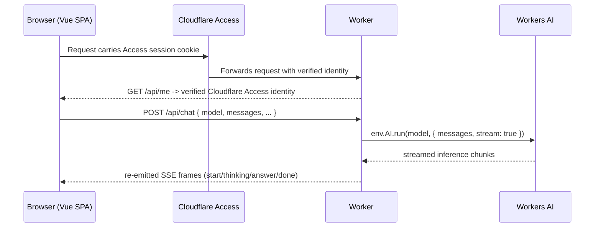

# AI Model Playground — What This Demo Teaches

## What This Demonstrates

- **The `AI` binding for server-side inference.** `env.AI.run(model, { messages, stream: true, ... })` runs serverless GPU inference directly from the Worker — no external model provider, and no call to Cloudflare's REST API from inside the Worker.
- **Server-Sent Events streaming so the first token reaches the browser immediately.** The Worker never buffers the whole answer before responding; it decodes the model's stream and re-emits its own SSE frames as they are produced.
- **Comparing reasoning and non-reasoning models, each with its own parameter bounds.** The catalog deliberately includes both kinds, and temperature/output-token limits are validated per model, not per adapter or globally.
- **A stateless Worker with browser-held conversation history.** The Worker keeps no state between requests; the whole conversation travels with every turn and lives only in the browser tab.
- **Cancellation of in-flight upstream inference.** Pressing Stop (or losing the connection) cancels the upstream Workers AI reader, so an abandoned generation actually stops running — and billing — instead of continuing unread.
- **Privacy-preserving observability.** Every turn logs latency and token counts, structured so prompt or completion text can never appear in a log field.

## How It Works

### Request flow

Terraform owns the Worker resource, the custom domain, the Access application and policy, and observability settings. Wrangler owns Worker code versions and deployments. `wrangler.jsonc` is generated at build/deploy time from `wrangler.jsonc.tpl` and Terraform outputs (or from committed local placeholder values in `infra/local-outputs.json` for a clean checkout) — see the repository's `AGENTS.md` for the general pattern.

**Workers AI itself is an account capability reached through a binding, not a provisioned resource**: there is nothing for Terraform to create in `infra/ai-chat.tf` and nothing for teardown to clean up, unlike a demo using D1, KV, R2, or Queues.

### The stateless Worker, the browser-held conversation

The Worker keeps **no state between requests**. Every `POST /api/chat` call sends the entire conversation so far (`{ model, messages, temperature?, maxTokens? }`); the Worker prepends its own server-owned system prompt, forwards the turn to the selected model, streams the answer back, and forgets everything the moment the response ends. The Pinia `chat` store (`src/client/stores/chat.ts`) is the only place the conversation is held — refreshing the page, or signing out and back in, loses it. This is deliberate: it is the point of the "stateless streaming proxy in front of a model" lesson, and adding a database or Durable Object here would teach nothing new while contradicting the scenario's "no persistent conversations" rule.

### Model catalog and how to add a model

`src/models.ts` is the single source of truth for the curated catalog, imported by **both** the Worker (validation, adapter selection) and the client (the model selector) — so it contains data and pure lookups only, never adapter implementations. Five models, five providers, two adapters, all three reasoning mechanisms:

| Display name | Provider | Adapter | Reasoning | Temperature | Max output tokens |
| --- | --- | --- | --- | --- | --- |
| Granite 4.0 H Micro (default) | IBM | `cf-native` | none | 0–5 (default 0.6) | up to 2048 (default 256) |
| Llama 4 Scout 17B | Meta | `cf-native` | none | 0–2 (default 0.7) | up to 2048 (default 512) |
| DeepSeek R1 Distill Qwen 32B | DeepSeek | `cf-native` | inline `<think>` tags | 0–5 (default 0.6) | up to 4096 (default 1024) |
| GLM 4.7 Flash | Zhipu AI | `openai-chat` | `reasoning_content` field | 0–2 (default 0.7) | up to 2048 (default 512) |
| Gemma 4 26B | Google | `openai-chat` | `reasoning_content` field | 0–2 (default 0.7) | up to 2048 (default 512) |

Granite is the default selection: it is the cheapest catalog entry, so an accidental first prompt costs the least, and it is the "small and fast" side of the demo's latency comparison.

Bounds are **per model, not per adapter** — Llama 4 Scout shares its input type with Granite and DeepSeek but has a real temperature ceiling of `2`, not `5` (verified by a live streaming spike; see `docs/DECISIONS.md`). `src/worker/chat/validation.ts` always clamps to the selected model's own descriptor, never to a shared adapter-wide constant.

To add a model:

1. Confirm the model is current at the [Workers AI model catalog](https://developers.cloudflare.com/workers-ai/models/) — do not add a deprecated model.
2. Run a throwaway streaming spike against the deployed account (`curl -N` against `POST /client/v4/accounts/{account}/ai/run/{model}` with `stream: true`) and record: the real per-chunk shape, where reasoning appears (if any), whether `usage` arrives and in which chunk, and the real temperature/output-token bounds. **Do not trust the model catalog page or the generated input type alone** — both describe the input shape, not necessarily the streaming output shape (this catalog has two models that share an input type but stream completely different chunk shapes).
3. Add one entry to `MODEL_CATALOG` in `src/models.ts` with the spike-verified bounds. TypeScript checks `id` against the generated `AiModels` keys (`worker-configuration.d.ts`), so a typo or a retired model ID is a compile error, not a runtime `404`.
4. **A new adapter is required only if the model's real request/response shape doesn't match either existing one.** Check whether the model's streaming chunks match:
   - `cf-native` (`src/worker/chat/adapters/cf-native.ts`) — accepts `max_tokens`, no `stream_options`; its `readChunk()` already tolerates *either* the plain `{ response, usage }` shape or the OpenAI delta shape, since the catalog already contains a model of each kind sharing this adapter's input type.
   - `openai-chat` (`src/worker/chat/adapters/openai-chat.ts`) — accepts `max_completion_tokens` and `stream_options: { include_usage: true }`; its chunks are always the OpenAI delta shape.
   If the model needs a genuinely different input field set, add a new module in `src/worker/chat/adapters/` exposing the same `buildInput()`/`run()`/`readChunk()` shape, add it to the `ADAPTERS` registry in `src/worker/chat/adapters/index.ts`, and add its ID to `ModelAdapterId` in `src/models.ts`.
5. If the model reports reasoning, set `reasoning` to `"reasoning-field"` (a distinct JSON field — no new code needed) or `"inline-think-tags"` (reused from DeepSeek's `src/worker/chat/reasoning.ts` splitter — also no new code needed, since the splitter is model-agnostic). A model with no reasoning uses `"none"`.
6. Add unit tests for the new adapter/reasoning path (colocated `*.test.ts`) and an integration test in `tests/integration/chat.test.ts` exercising the new adapter shape end to end with a scripted fake `Ai`.

### Streaming protocol

The Worker never proxies the model's raw SSE bytes to the browser — it decodes them (`src/sse.ts`), normalizes them through the model's adapter, separates reasoning from the answer, and **re-emits its own** SSE stream (`src/worker/chat/stream.ts`) with `Content-Type: text/event-stream`, `Cache-Control: no-store`, and `X-Content-Type-Options: nosniff`. Frames, defined once in `src/chat-protocol.ts` and shared by the Worker, the client, and tests:

- `start` — sent immediately, so the browser can confirm the stream opened.
- `thinking` — a reasoning-text delta (only for a model whose descriptor declares reasoning).
- `answer` — an answer-text delta.
- `done` — the last frame of a normal or stopped turn: `finishReason`, `ttftMs`, `totalMs`, and `usage` (`{ promptTokens, completionTokens, totalTokens }` or `null` when the model reported none).
- `error` — a failure **after** the first byte, when the HTTP status can no longer change (a failure **before** the first byte is instead an ordinary RFC 9457 JSON response).

The Worker re-emits rather than proxies because the catalog is not shape-homogeneous (three of the five models stream `response`, the other two stream `choices[0].delta.content`), because reasoning has to be separated from the answer server-side, and because the `done` frame is where latency and usage are measured and logged — there is no other point at which the Worker knows the turn is complete.

Cancelling the response stream (the browser's **Stop** control, or a lapsed connection) cancels the upstream Workers AI reader too, so an abandoned generation actually stops running — and billing — instead of continuing unread.

### Workers AI has no local simulation

This is the single most important operational fact about this demo, and it shapes the Wrangler config, local development, and every test:

- Workers AI has no local simulator. The `AI` binding is declared `{ "binding": "AI", "remote": true }`. Cloudflare **errors** if `remote` is `false` and warns (while still connecting remotely) if it is omitted.
- Consequently, `vite dev` opens a real, credentialed remote-binding session against the account and needs `CLOUDFLARE_API_TOKEN` and `CLOUDFLARE_ACCOUNT_ID`. Wrangler reads these from `.env` in this same directory — no additional export or wrapper script is required.
- The committed `.dev.vars` earns its keep twice: it sets a local `ENVIRONMENT`, and because Wrangler ignores `.env` for the Worker's own `env` object once `.dev.vars` exists, it also keeps the deployment token out of `env` — a Worker must never be able to read the account's own API token.
- `vite build` does **not** open a remote session, so a clean checkout with no credentials still builds and type-checks.
- `@cloudflare/vitest-pool-workers` starts a remote proxy session for **any** binding with no local simulator — including `ai` — regardless of the `remote` flag. Left alone, `npm test` on a clean checkout would demand credentials and network access. `tests/integration/vitest.config.ts` therefore sets `remoteBindings: false`; `env.AI` still exists in tests but is non-functional, which is correct — every integration test injects a scripted fake `Ai` implementation (`tests/integration/fixtures.ts`) instead of calling the real binding.
- Consequently, real inference cannot be automated. After every deployment, submit one prompt to each catalog model on the deployed hostname and confirm streaming, the Thinking panel, and reported usage.

### Input caps

`src/worker/chat/validation.ts` and `src/worker/middleware/body-limit.ts` are the demo's cost and abuse control, alongside authentication:

| Limit | Value |
| --- | --- |
| Request body size | 65,536 bytes (`413` before any JSON parsing is attempted) |
| Messages per request | 40 |
| Characters per message | 4,000 |
| Total characters per request | 24,000 |

A client-supplied `system`-role message is rejected outright (`422`) — the system prompt is a server-owned constant (`SYSTEM_PROMPT` in `validation.ts`), never request input. `temperature` and `maxTokens` are clamped, never rejected, to the selected model's own descriptor bounds.

### Access model

Inference is billable compute, so no route in this demo is anonymous. The **entire `ai-chat.cfapps.uk` hostname** is gated by a single Cloudflare Access self-hosted application backed by an `allow` policy requiring authentication through a configured identity provider. There is **no** public bypass application.

- The SPA shell is served by the `ASSETS` `single-page-application` fallback and gated at the edge by Access before the request reaches the Worker, so page routes need no Worker route or `run_worker_first` entry.
- `cloudflareAccess()` is mounted **once, globally** in `src/worker/index.ts`. It deliberately does **not** validate the Access `audience`; it derives the caller's identity (email) from the verified Access identity on every request and never from client input.
- `src/access-policies.ts` is **fail-safe**: `/api/*` → `authenticate: true, redirect: false` (so a `fetch()` — including one that reads a Server-Sent Events stream — receives a `401`/`403` instead of an HTML sign-in redirect), then a catch-all `/` → `authenticate: true, redirect: true` for pages. Every entry authenticates, so a route added later cannot accidentally become public.
- Because any authenticated user is a legitimate user of the playground, no per-email allowlist is used by default. **To tighten this for cost control**, narrow `cloudflare_zero_trust_access_policy.authenticated_users` in `infra/access.tf` — for example, replace `include = [{ everyone = {} }]` with a specific email list (`include = [{ email = { email = "you@example.com" } }]`), an email domain (`email_domain`), or a Zero Trust group. A permissive identity provider such as one-time PIN would otherwise make paid inference broadly reachable to anyone who can receive an email. The input caps above are the in-application half of that control.
- **A session can expire mid-conversation, between turns.** The browser POSTs to a same-origin `/api/*` URL, so the Access cookie travels with it, but if the session has lapsed the response is a `401` JSON body, not an event stream. `src/client/lib/stream-reader.ts` checks the response status and `Content-Type` **before** treating the body as SSE, and the playground surfaces a "Your session expired" notice with a reload control instead of failing to parse JSON as event-stream frames.

### Workers AI cost and cold start

- Workers AI has a free daily allocation of Neurons per account (10,000/day as of this writing), then billed per-Neuron consumption above it — check the current [Workers AI pricing](https://developers.cloudflare.com/workers-ai/platform/pricing/) before a sustained demo session, since usage does not reset mid-day.
- The Cloudflare dashboard's **Workers AI** metrics page (Account Home → Workers AI) reports requests per model and Neurons consumed, independent of this Worker's own logs — useful for showing the product-side view of the same activity during a presentation.
- **Cold start**: the first request to a given model after a period of inactivity has materially higher time-to-first-token than a subsequent request, since Workers AI has to provision GPU capacity for that model. The activity-dots indicator (`ActivityIndicator.vue`) exists specifically to make this latency visible rather than looking like a hang; a live demo's first prompt to any given model should be expected to take noticeably longer than the second.

### Observability

`src/worker/routes/chat.ts` emits five informational structured log events per turn, all built through `buildInferenceLogFields()` (`src/worker/chat/log-fields.ts`), which **structurally cannot** carry prompt or completion text, tokens, authorization headers, or the Access JWT — only `model`, `requestId`, `messageCount`, `totalCharacters`, timing (`ttftMs`/`totalMs`), token usage, and `finishReason`/`status`/`detail` where applicable:

| Event | When |
| --- | --- |
| `ai_prompt_submitted` | After validation succeeds, before the upstream call. |
| `ai_first_token` | On the first `thinking`/`answer` delta. |
| `ai_stream_completed` | On a normal `done` frame. |
| `ai_stream_aborted` | When the consumer (Stop, or a closed connection) cancels the stream. |
| `ai_inference_failed` | On a post-first-byte upstream failure (`error` frame). |

All five logs are placed after the Access and validation guards, so they only ever reflect authorized, valid requests.

## Further Reading

- [Cloudflare Workers AI](https://developers.cloudflare.com/workers-ai/)
- [Workers AI models catalog](https://developers.cloudflare.com/workers-ai/models/)
- [Workers AI pricing](https://developers.cloudflare.com/workers-ai/platform/pricing/)
- [Server-sent events (MDN)](https://developer.mozilla.org/en-US/docs/Web/API/Server-sent_events)
- [Cloudflare Access applications](https://developers.cloudflare.com/cloudflare-one/access-controls/applications/)
- [Cloudflare Access policies](https://developers.cloudflare.com/cloudflare-one/access-controls/policies/)
- [Workers observability](https://developers.cloudflare.com/workers/observability/)
- [Workers Logs](https://developers.cloudflare.com/workers/observability/logs/workers-logs/)
- [Workers traces](https://developers.cloudflare.com/workers/observability/traces/)
- [RFC 9457 — Problem Details for HTTP APIs](https://www.rfc-editor.org/rfc/rfc9457)
- [Hono](https://hono.dev/docs/getting-started/cloudflare-workers)
