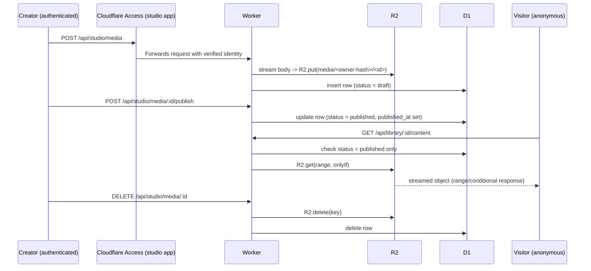

# Media Drop — What This Demo Teaches

## What This Demonstrates

- **R2 for bytes, D1 for metadata.** Media Drop stores object bytes (images, audio, video) in an R2 bucket and keeps every searchable, mutable fact about that object — title, owner, content type, size, publication status, timestamps — in a D1 row that merely points at the R2 key. Splitting the two means metadata queries (listing, filtering by owner or status) never move object bytes through D1, and object storage never has to model relational lookups it is not built for.
- **Streaming uploads and downloads through an authorized Worker.** The R2 bucket is never public. Every read and write flows through the Worker, which streams the request body straight into R2 on upload (`bucket.put(key, request.body, ...)`) and streams the object body straight back out on download, without buffering a whole file in Worker memory.
- **Range and conditional request support for audio/video streaming.** `R2Bucket.get()` accepts the incoming request's `Range` and conditional (`If-None-Match`, `If-Modified-Since`, etc.) headers directly, and the Worker forwards R2's resulting partial-content and not-modified semantics back to the browser. This is what lets a `<video>` or `<audio>` element seek and resume instead of re-downloading the whole file.
- **Mixing a public and a narrower authenticated Cloudflare Access application on one hostname.** The pattern is the same one `demos/url-shortener` establishes: a hostname-wide bypass application keeps the library public, while a second, more specific application requires authentication only for `/studio*` and `/api/studio*`. Access routes each request to the most specific matching application, so both applications coexist without a third "everything else" policy.

## How It Works

### Data flow: upload → draft → publish → public read

Every studio route resolves the caller's D1 rows and R2 key by the verified Access identity's email, never by a client-supplied owner field, so one creator's requests can never reach another creator's object or metadata.

### Two Access applications, one hostname

`infra/access.tf` defines:

- A **public library** application (`domain = <hostname>`) with a `bypass` policy for `everyone`, covering the whole hostname.
- A **studio** application scoped with explicit `destinations` for `/studio*` and `/api/studio*`, with an `allow` policy for any authenticated user (`everyone`) — any signed-in identity is a legitimate creator.

Cloudflare Access evaluates the most specific matching application per request: `/studio*` and `/api/studio*` requests match the narrower studio application and require a verified identity, while every other request on the hostname (the library pages, `/api/library/*`, static assets) falls through to the public bypass application and receives no Access JWT at all. `src/access-policies.ts` mirrors this same ordering for the Worker's `cloudflareAccess()` middleware and the local development Access emulator, so `authenticate: false` paths never attempt to read or validate a token that bypassed traffic was never issued.

`/studio` itself is never routed through the Worker — `wrangler.jsonc.tpl`'s `run_worker_first` only lists `/api/*`. The page is served directly by the `ASSETS` binding's single-page-application fallback, because Access already enforces authentication at the edge before the request reaches the Worker or the assets layer.

### R2 key scheme and owner isolation without an audience check

`src/worker/media/storage.ts` derives each object's R2 key from a SHA-256 digest of the owner's verified email rather than the raw address (`media/<owner-hash>/<id>`), so a raw email never appears in object storage. Following `demos/todo-app`, the studio API deliberately does not validate the Access application `audience` — every Access application on a team shares the same JWKS, so a token audience check alone only proves *some* application in the team issued the token, and here it would add no real protection anyway, because any authenticated identity is a valid creator. Instead, every D1 query and R2 key lookup in `src/worker/routes/studio.ts` is scoped to `context.get("Cloudflare_Access_Identity").email`, so a signed-in creator's requests can only ever resolve rows and keys under their own owner hash — the owner-scoping *is* the isolation boundary, not the token audience.

### Publish and delete

Publishing flips a draft's `status` to `published` and sets `published_at`; nothing about the R2 object changes, since visibility is a metadata property, not a storage-location property. Deleting removes the R2 object first and the D1 row second (`src/worker/routes/studio.ts`), so a successful delete never leaves an orphaned object with no metadata pointing at it — the failure mode of deleting the row first would be worse, since a dangling object would then be permanently ungoverned.

### Observability

`cloudflareLogger()` provides request-scoped structured logging. The studio and library routers each emit one informational event per successful action — `media_uploaded`, `media_published`, `media_downloaded`, `media_deleted` — placed after every Access, validation, and ownership guard so they reflect only authorized activity, and containing only the media ID, content type, byte size, and caller identity, never object bytes or authorization headers. Terraform enables Workers Logs at 100% sampling and traces at 10% sampling on the Worker resource.

## Further Reading

- [Cloudflare Workers](https://developers.cloudflare.com/workers/)
- [Workers best practices](https://developers.cloudflare.com/workers/best-practices/workers-best-practices/)
- [Cloudflare R2](https://developers.cloudflare.com/r2/)
- [R2 Workers API reference](https://developers.cloudflare.com/r2/api/workers/workers-api-reference/) (ranged reads and conditional operations)
- [R2 error codes](https://developers.cloudflare.com/r2/api/error-codes/)
- [Cloudflare D1](https://developers.cloudflare.com/d1/)
- [D1 Worker Database API](https://developers.cloudflare.com/d1/worker-api/d1-database/)
- [D1 migrations](https://developers.cloudflare.com/d1/reference/migrations/)
- [Cloudflare Access applications](https://developers.cloudflare.com/cloudflare-one/access-controls/applications/)
- [Cloudflare Access policies](https://developers.cloudflare.com/cloudflare-one/access-controls/policies/)
- [Manage reusable Access policies](https://developers.cloudflare.com/cloudflare-one/access-controls/policies/policy-management/)
- [Workers observability](https://developers.cloudflare.com/workers/observability/)
- [Workers Logs](https://developers.cloudflare.com/workers/observability/logs/workers-logs/)
- [Workers traces](https://developers.cloudflare.com/workers/observability/traces/)
- [RFC 9457 — Problem Details for HTTP APIs](https://www.rfc-editor.org/rfc/rfc9457)
- [Hono](https://hono.dev/docs/getting-started/cloudflare-workers)
