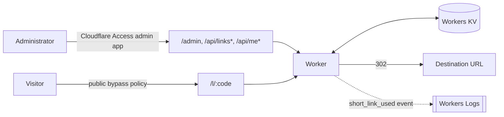

# URL Shortener — What This Demo Teaches

## What This Demonstrates

- **One Worker, two audiences.** A single Worker serves the Vue administration UI as static assets, a Hono JSON API, and a public redirect route. There is no separate frontend deployment or reverse proxy — Cloudflare Workers static assets and application code share the same service and the same deployment.
- **Workers KV as a low-latency, eventually-consistent store.** Each short link is a small, infrequently-written, frequently-read JSON record — exactly the read-heavy access pattern Workers KV is designed for. The demo also surfaces the cost of that design: a write is not guaranteed to be immediately visible everywhere.
- **Mixing public and authenticated routes on one hostname with Cloudflare Access.** A hostname-wide bypass application keeps `/l/*` public, while a second, narrower Access application layered on top requires authentication for `/admin*`, `/api/links*`, and `/api/me*`. Access evaluates the most specific matching application per request, so both applications can coexist without a third "everything else" policy.
- **Defense-in-depth identity checks beyond "a valid Access JWT."** Because every Access application in a Cloudflare Access team shares the same JWKS, verifying a token alone only proves *some* application in the team issued it — not that it was issued for *this* application. The demo shows compensating for that at the application layer instead of relying solely on the platform check.
- **Informational structured logging tied to real backend activity.** Workers Logs shows one event per redirect, correlated and free of sensitive data, rather than raw access logs.

## How It Works

### Request flow

Terraform owns the Worker resource, the KV namespace, the custom domain, both Access applications and policies, and observability configuration. Wrangler owns Worker code versions, deployments, and the static-assets bundle. `wrangler.jsonc` is generated at build/deploy time from `wrangler.jsonc.tpl` and Terraform outputs (or from committed local placeholder values in `infra/local-outputs.json` for a clean checkout) — see the repository's `AGENTS.md` for the general pattern.

### Two Access applications, one hostname

`infra/access.tf` defines:

- A **public** application (`domain = <hostname>`) with a `bypass` policy for `everyone`, covering the whole hostname including `/l/*`.
- An **administrator** application scoped with explicit `destinations` for `/admin*`, `/api/links*`, and `/api/me*`, with an `allow` policy limited to `ADMIN_EMAIL`.

Cloudflare Access routes each request to the most specific matching application. Requests to `/admin*` or the API paths match the narrower administrator application and require authentication; every other request on the hostname falls through to the public bypass application. No third, catch-all policy is needed.

`/admin*` is never routed through the Worker in production — `wrangler.jsonc.tpl`'s `run_worker_first` only lists `/api/*` and `/l/*`. The page is served directly by the `ASSETS` binding's single-page-application fallback, because Access already enforces authentication at the edge before the request reaches either the Worker or the assets layer. The client (`src/client/main.ts`) also forces a document-level redirect from `/` to `/admin` before Vue mounts, so an anonymous visitor is never served the application shell, only the Access login/denial experience.

### Compensating for shared JWKS

`src/worker/middleware/access.ts` validates that a request carries a Cloudflare Access JWT for `CLOUDFLARE_TEAM_DOMAIN`, but deliberately does not pin the exact Access application `audience`. Any valid Access JWT from that team — not only one minted for this application — would pass that check alone. `src/worker/middleware/require-admin.ts` compensates by additionally comparing the verified identity's email against `ADMIN_EMAIL` on every management route, returning an RFC 9457 `403` otherwise. `/api/me` exists specifically so the admin SPA can confirm this server-side check passed before rendering the management UI, rather than trusting the Access identity alone.

### Data model and KV consistency

`src/worker/links/repository.ts` stores each link as JSON under a `link:<code>` key. Codes are generated with Web Crypto random bytes and are immutable — administrators may only change a link's destination, never its code — so code collisions do not depend on a globally consistent read-before-write check.

Workers KV is eventually consistent: a write is usually visible immediately in the Cloudflare location where it was made, but can take up to about 60 seconds (or more) to propagate to other locations as their cached reads expire. The admin UI updates its own local state directly from the create/update response rather than re-reading from KV, so the presenter always sees their own change immediately; a visitor hitting a different Cloudflare location may briefly see a stale or missing redirect. The redirect handler (`src/worker/routes/redirects.ts`) also returns `Cache-Control: no-store` on every `302`, so edits are re-evaluated on the next request instead of being cached by the browser or Cloudflare's cache.

### Observability

`cloudflareLogger()` provides request-scoped structured logging. `redirects.ts` emits one informational `short_link_used` event per redirect containing only `code`, a correlated `requestId`, and `service` — deliberately excluding destination URLs, visitor IP addresses, and authorization data. Terraform enables Workers Logs at 100% sampling and traces at 10% sampling on the Worker resource.

## Further Reading

- [Cloudflare Workers](https://developers.cloudflare.com/workers/)
- [Workers best practices](https://developers.cloudflare.com/workers/best-practices/workers-best-practices/)
- [Workers static assets](https://developers.cloudflare.com/workers/static-assets/)
- [Cloudflare Workers KV](https://developers.cloudflare.com/kv/)
- [How KV works (consistency model)](https://developers.cloudflare.com/kv/concepts/how-kv-works/)
- [Cloudflare Access applications](https://developers.cloudflare.com/cloudflare-one/access-controls/applications/)
- [Cloudflare Access policies](https://developers.cloudflare.com/cloudflare-one/access-controls/policies/)
- [Manage reusable Access policies](https://developers.cloudflare.com/cloudflare-one/access-controls/policies/policy-management/)
- [Workers observability](https://developers.cloudflare.com/workers/observability/)
- [Workers Logs](https://developers.cloudflare.com/workers/observability/logs/workers-logs/)
- [Workers traces](https://developers.cloudflare.com/workers/observability/traces/)
- [RFC 9457 — Problem Details for HTTP APIs](https://www.rfc-editor.org/rfc/rfc9457)
- [Hono](https://hono.dev/docs/getting-started/cloudflare-workers)
